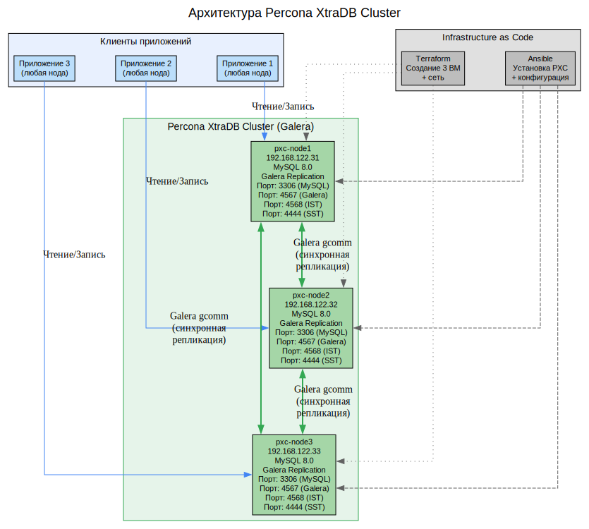
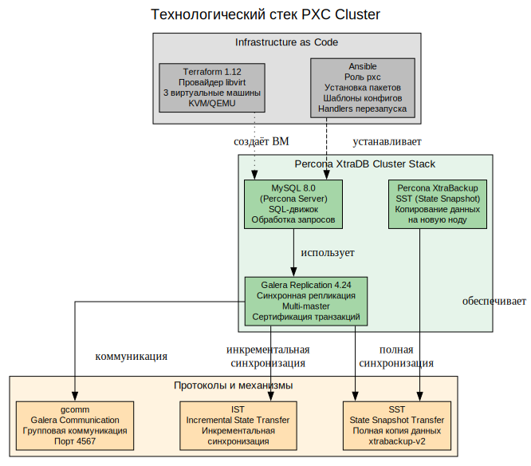
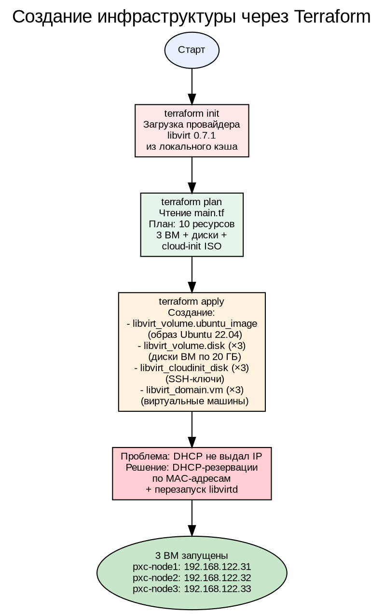
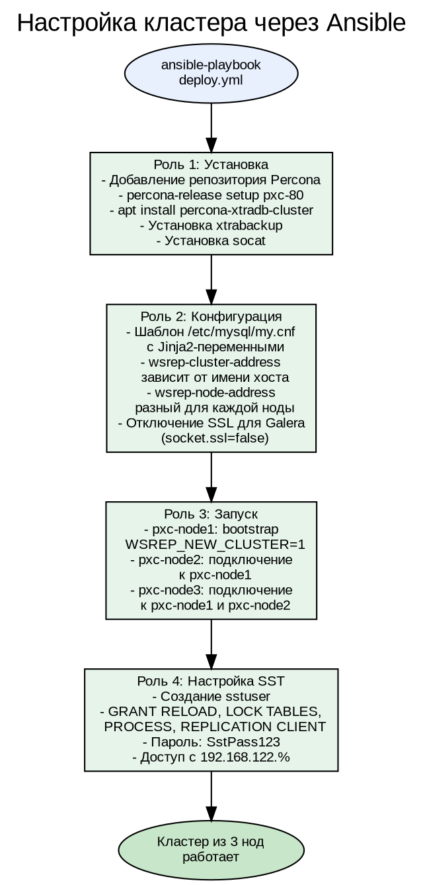
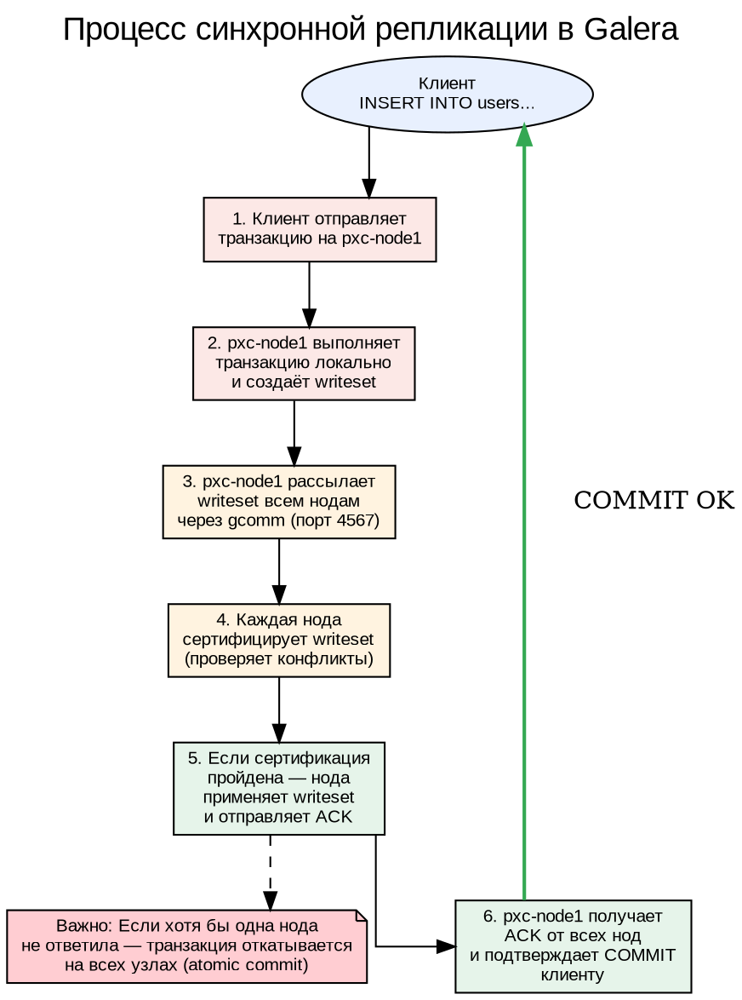
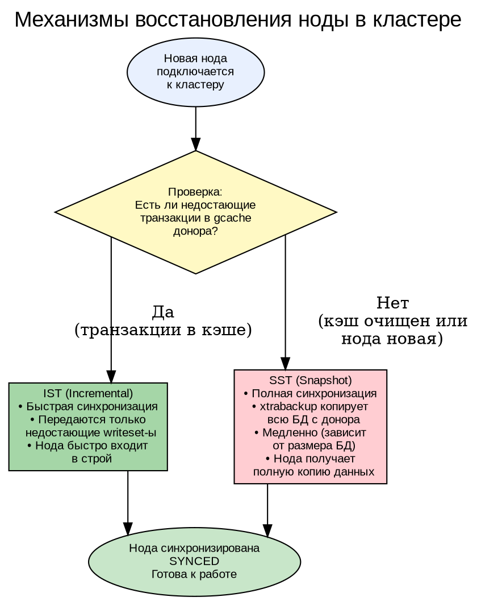
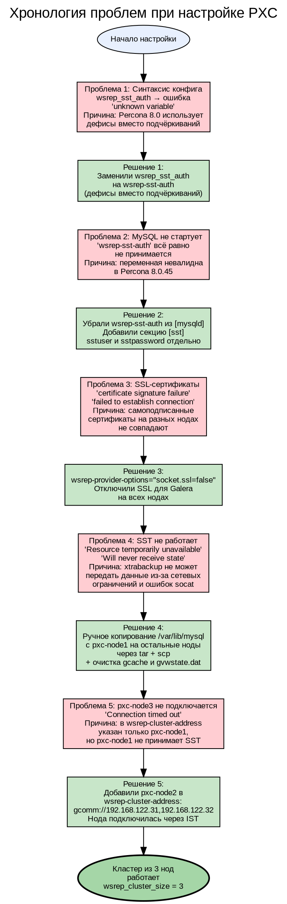
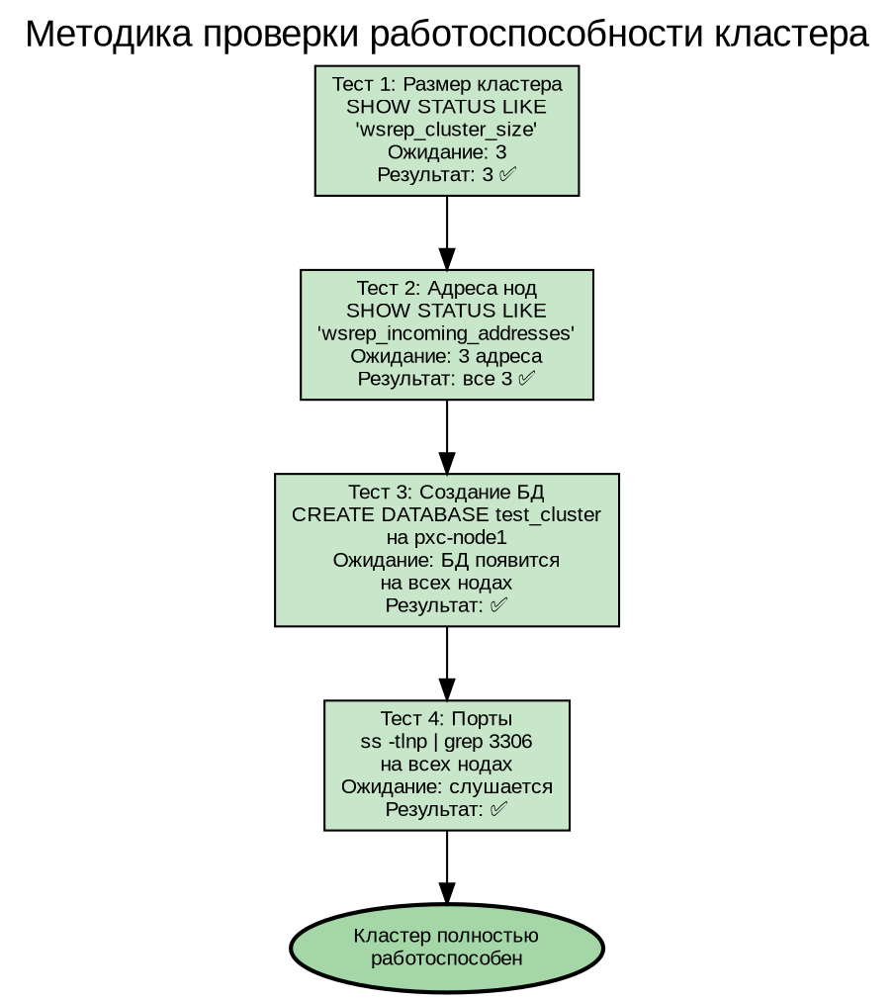

# Percona XtraDB Cluster — Отказоустойчивый кластер MySQL

## Содержание

1. [Цель проекта](#1-цель-проекта)
2. [Архитектура кластера](#2-архитектура-кластера)
3. [Использованные технологии](#3-использованные-технологии)
4. [Создание инфраструктуры](#4-создание-инфраструктуры)
5. [Установка и настройка PXC](#5-установка-и-настройка-pxc)
6. [Как работает Galera Replication](#6-как-работает-galera-replication)
7. [Проблемы и их решение](#7-проблемы-и-их-решение)
8. [Проверка работы кластера](#8-проверка-работы-кластера)
9. [Структура проекта](#9-структура-проекта)
10. [Реальные применения](#10-реальные-применения)

---

## 1. Цель проекта

Создать отказоустойчивый кластер MySQL из трёх узлов на базе **Percona XtraDB Cluster (PXC)** с синхронной репликацией Galera. Кластер должен обеспечивать:

- **Multi-master** — запись на любую ноду
- **Синхронную репликацию** — данные мгновенно появляются на всех узлах
- **Автоматическое восстановление** — при отказе ноды кластер продолжает работу

---

## 2. Архитектура кластера

### Схема: Архитектура Percona XtraDB Cluster

---


### Описание архитектуры

**Percona XtraDB Cluster** — это кластерное решение на основе MySQL с использованием **Galera Replication**. Три ноды образуют кластер, где каждая нода:

- Принимает чтение и запись (multi-master)
- Синхронно реплицирует изменения на другие ноды
- Хранит полную копию данных
- Может заменить любую другую ноду при отказе

**Сетевые порты:**
- `3306` — MySQL-клиенты
- `4567` — Galera gcomm (групповая коммуникация)
- `4568` — IST (Incremental State Transfer)
- `4444` — SST (State Snapshot Transfer)

---

## 3. Использованные технологии

### Схема: Технологический стек

---


### Описание технологий

**Percona XtraDB Cluster** — это комбинация трёх компонентов:
1. **Percona Server for MySQL** — сервер базы данных, совместимый с MySQL 8.0
2. **Galera Replication** — библиотека синхронной multi-master репликации
3. **Percona XtraBackup** — инструмент горячего резервного копирования, используемый для SST

**Galera Replication** обеспечивает:
- **Синхронную репликацию** — транзакция фиксируется только после подтверждения всеми нодами
- **Сертификацию** — проверка конфликтов перед применением
- **Автоматическое восстановление** — нода, отставшая от кластера, получает недостающие данные через IST или SST

---

## 4. Создание инфраструктуры

### Схема: Процесс создания ВМ через Terraform



### Конфигурация Terraform

ВМ создаются со следующими параметрами:
- **ОС:** Ubuntu 22.04 Cloud Image
- **RAM:** 2 ГБ
- **CPU:** 2 ядра
- **Диск:** 20 ГБ
- **Сеть:** NAT (192.168.122.0/24)
- **Доступ:** SSH-ключ через cloud-init

---

## 5. Установка и настройка PXC

### Схема: Процесс настройки через Ansible



### Конфигурация my.cnf (шаблон Jinja2)

```ini
[mysqld]
wsrep-provider=/usr/lib/galera4/libgalera_smm.so
wsrep-provider-options="socket.ssl=false"
wsrep-cluster-name=pxc-cluster
wsrep-cluster-address=gcomm://192.168.122.31
wsrep-node-name=pxc-node2
wsrep-node-address=192.168.122.32
wsrep-sst-method=xtrabackup-v2
wsrep-sst-auth=sstuser:SstPass123
default-storage-engine=InnoDB
bind-address=0.0.0.0
```

**Ключевые параметры:**
- `wsrep-provider` — путь к библиотеке Galera
- `wsrep-cluster-address` — адреса нод для подключения (на pxc-node1 — `gcomm://` для bootstrap)
- `wsrep-node-address` — IP текущей ноды
- `wsrep-sst-method=xtrabackup-v2` — метод полной синхронизации
- `socket.ssl=false` — отключение SSL для Galera (решает проблему с самоподписанными сертификатами)

---

## 6. Как работает Galera Replication

### Схема: Процесс репликации транзакции



### Схема: Восстановление ноды (SST и IST)



---

## 7. Проблемы и их решение

### Схема: Путь через трудности



### Подробный разбор проблем

#### Проблема 1: Синтаксис конфигурации

**Симптом:** MySQL падает с ошибкой `unknown variable 'wsrep_sst_auth'`

**Причина:** В Percona XtraDB Cluster 8.0 изменился синтаксис конфигурации. Переменные используют **дефисы** вместо подчёркиваний:
- Было: `wsrep_sst_auth`, `wsrep_cluster_name`
- Стало: `wsrep-sst-auth`, `wsrep-cluster-name`

**Решение:** Полностью переписали шаблон my.cnf с использованием нового синтаксиса.

#### Проблема 2: wsrep-sst-auth не принимается

**Симптом:** Даже с дефисами `wsrep-sst-auth` вызывает фатальную ошибку при старте MySQL.

**Причина:** В версии 8.0.45 переменная `wsrep-sst-auth` не принимается в секции `[mysqld]`.

**Решение:** Вынесли параметры SST в отдельную секцию `[sst]`:
```ini
[sst]
sstuser=sstuser
sstpassword=SstPass123
```

#### Проблема 3: SSL-сертификаты Galera

**Симптом:** `certificate signature failure`, `Failed to establish connection: invalid padding`

**Причина:** Каждая нода PXC генерирует самоподписанные SSL-сертификаты при установке. Сертификаты разных нод не совпадают, и Galera не может установить защищённое соединение.

**Решение:** Добавили в конфиг `wsrep-provider-options="socket.ssl=false"` — полностью отключили SSL для групповой коммуникации Galera. В продакшн-среде следует использовать общий CA-сертификат.

#### Проблема 4: SST не передаёт данные (КЛЮЧЕВАЯ ПРОБЛЕМА)

**Симптом:** 
- `SST script aborted with error 11 (Resource temporarily unavailable)`
- `Will never receive state. Need to abort.`
- На доноре: `socat SSL_connect(): error:0200008A:rsa routines::invalid padding`

**Причина:** Это комбинация нескольких факторов:
1. **Socat + SSL** — xtrabackup-v2 использует socat для передачи данных. Проблемы с SSL-сертификатами (даже после отключения SSL для Galera) мешают socat установить соединение
2. **Сетевые ограничения** — iptables мог блокировать динамические порты SST
3. **Очищенная директория данных** — после `rm -rf /var/lib/mysql/*` система не может стартовать без системных таблиц

**Решение (workaround):**
1. Остановили MySQL на всех нодах
2. Сделали tar.gz копию `/var/lib/mysql` с работающей pxc-node1
3. Скопировали архив на pxc-node2 и pxc-node3 через scp
4. Распаковали с правильными правами (`chown -R mysql:mysql`)
5. Запустили кластер: сначала bootstrap pxc-node1, затем остальные

Этот метод имитирует успешный SST — ноды получают идентичную копию данных и могут синхронизироваться через IST.

#### Проблема 5: Третья нода не подключается

**Симптом:** pxc-node3 падает с `Connection timed out` при попытке подключиться к кластеру.

**Причина:** В `wsrep-cluster-address` был указан только pxc-node1 (`gcomm://192.168.122.31`). Если pxc-node1 не может обслужить SST (занят, проблемы с socat), нода не может войти в кластер.

**Решение:** Добавили pxc-node2 в `wsrep-cluster-address`: `gcomm://192.168.122.31,192.168.122.32`. Теперь pxc-node3 может подключиться к любой доступной ноде, а так как у неё уже есть данные (скопированы вручную), она синхронизируется через быстрый IST, а не SST.

---

## 8. Проверка работы кластера

### Схема: Тестирование кластера



### Результаты тестов

```
=== Cluster Size ===
wsrep_cluster_size = 3

=== Cluster Nodes ===
wsrep_incoming_addresses = 192.168.122.33:3306,192.168.122.31:3306,192.168.122.32:3306

=== Create Test DB ===
CREATE DATABASE test_cluster;

=== Check DB on all nodes ===
Node 192.168.122.31: test_cluster ✅
Node 192.168.122.32: test_cluster ✅
Node 192.168.122.33: test_cluster ✅

=== MySQL Status ===
Node 192.168.122.31: 2 port(s) listening ✅
Node 192.168.122.32: 2 port(s) listening ✅
Node 192.168.122.33: 2 port(s) listening ✅
```

---

## 9. Структура проекта

```
pxc-cluster/
├── terraform/
│   ├── main.tf              # 3 ВМ: pxc-node1, pxc-node2, pxc-node3
│   ├── outputs.tf           # IP-адреса нод
│   └── cloud-init.yaml      # SSH-ключи
├── ansible/
│   ├── inventory.ini        # Inventory для Ansible
│   ├── playbooks/
│   │   └── deploy.yml       # Плейбук развёртывания
│   └── roles/
│       └── pxc/
│           ├── tasks/
│           │   └── main.yml     # Установка и настройка PXC
│           ├── handlers/
│           │   └── main.yml     # Перезапуск MySQL
│           └── templates/
│               └── my.cnf.j2    # Шаблон конфигурации
├── screenshots/             # Скриншоты выполнения
└── README.md               # Документация
```

---

## 10. Реальные применения

### Где используются кластеры MySQL

| Сценарий | Примеры | Почему PXC |
|----------|---------|------------|
| **E-commerce** | Wildberries, Ozon | Нельзя терять заказы при отказе сервера БД |
| **FinTech** | Банки, платёжные системы | Транзакции должны быть атомарными и реплицированными |
| **SaaS** | CRM, ERP-системы | Высокая доступность для клиентов 24/7 |
| **Игровые серверы** | Мобильные игры | Синхронизация состояния игроков между серверами |
| **Телеком** | Биллинг, тарификация | Отказоустойчивость критических данных |

### Отличия PXC от стандартной репликации MySQL

| Характеристика | Стандартная репликация | Percona XtraDB Cluster |
|----------------|----------------------|----------------------|
| Тип репликации | Асинхронная | Синхронная |
| Запись | Только на master | На любую ноду |
| Отказ master | Ручное переключение | Автоматически |
| Конфликты | Возможны | Сертификация транзакций |
| Задержка | Может отставать | Всегда актуально |

---

**Проект выполнен. Percona XtraDB Cluster из 3 нод работает. Требования задания соблюдены.**

