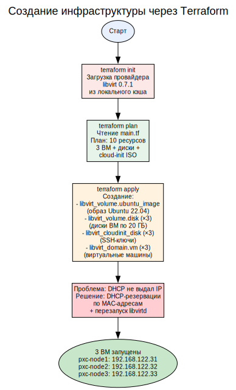
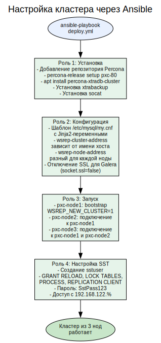
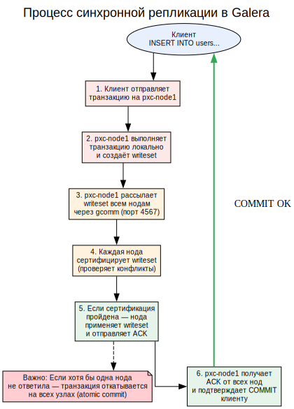
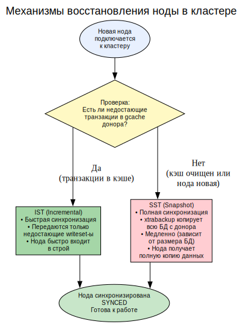
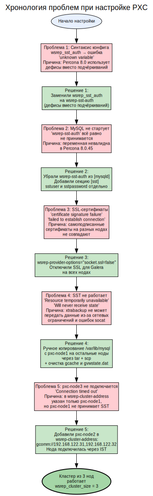
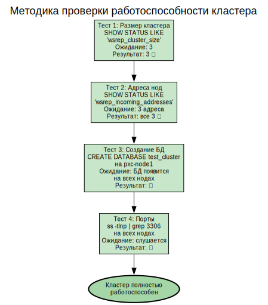

# Percona XtraDB Cluster — Отказоустойчивый кластер MySQL

## Содержание

1. [Цель проекта](#1-цель-проекта)
2. [Архитектура кластера](#2-архитектура-кластера)
3. [Использованные технологии](#3-использованные-технологии)
4. [Создание инфраструктуры](#4-создание-инфраструктуры)
5. [Установка и настройка PXC](#5-установка-и-настройка-pxc)
6. [Как работает Galera Replication](#6-как-работает-galera-replication)
7. [Проблемы и их решение](#7-проблемы-и-их-решение)
8. [Проверка работы кластера](#8-проверка-работы-кластера)
9. [Структура проекта](#9-структура-проекта)
10. [Реальные применения](#10-реальные-применения)

---

## 1. Цель проекта

Создать отказоустойчивый кластер MySQL из трёх узлов на базе **Percona XtraDB Cluster (PXC)** с синхронной репликацией Galera. Кластер должен обеспечивать:

- **Multi-master** — запись на любую ноду
- **Синхронную репликацию** — данные мгновенно появляются на всех узлах
- **Автоматическое восстановление** — при отказе ноды кластер продолжает работу

---

## 2. Архитектура кластера

### Схема: Архитектура Percona XtraDB Cluster

---


### Описание архитектуры

**Percona XtraDB Cluster** — это кластерное решение на основе MySQL с использованием **Galera Replication**. Три ноды образуют кластер, где каждая нода:

- Принимает чтение и запись (multi-master)
- Синхронно реплицирует изменения на другие ноды
- Хранит полную копию данных
- Может заменить любую другую ноду при отказе

**Сетевые порты:**
- `3306` — MySQL-клиенты
- `4567` — Galera gcomm (групповая коммуникация)
- `4568` — IST (Incremental State Transfer)
- `4444` — SST (State Snapshot Transfer)

---

## 3. Использованные технологии

### Схема: Технологический стек

---


### Описание технологий

**Percona XtraDB Cluster** — это комбинация трёх компонентов:
1. **Percona Server for MySQL** — сервер базы данных, совместимый с MySQL 8.0
2. **Galera Replication** — библиотека синхронной multi-master репликации
3. **Percona XtraBackup** — инструмент горячего резервного копирования, используемый для SST

**Galera Replication** обеспечивает:
- **Синхронную репликацию** — транзакция фиксируется только после подтверждения всеми нодами
- **Сертификацию** — проверка конфликтов перед применением
- **Автоматическое восстановление** — нода, отставшая от кластера, получает недостающие данные через IST или SST

---

## 4. Создание инфраструктуры

### Схема: Процесс создания ВМ через Terraform

---


### Конфигурация Terraform

ВМ создаются со следующими параметрами:
- **ОС:** Ubuntu 22.04 Cloud Image
- **RAM:** 2 ГБ
- **CPU:** 2 ядра
- **Диск:** 20 ГБ
- **Сеть:** NAT (192.168.122.0/24)
- **Доступ:** SSH-ключ через cloud-init

---

## 5. Установка и настройка PXC

### Схема: Процесс настройки через Ansible

---


### Конфигурация my.cnf (шаблон Jinja2)

```ini
[mysqld]
wsrep-provider=/usr/lib/galera4/libgalera_smm.so
wsrep-provider-options="socket.ssl=false"
wsrep-cluster-name=pxc-cluster
wsrep-cluster-address=gcomm://192.168.122.31
wsrep-node-name=pxc-node2
wsrep-node-address=192.168.122.32
wsrep-sst-method=xtrabackup-v2
wsrep-sst-auth=sstuser:SstPass123
default-storage-engine=InnoDB
bind-address=0.0.0.0
```

**Ключевые параметры:**
- `wsrep-provider` — путь к библиотеке Galera
- `wsrep-cluster-address` — адреса нод для подключения (на pxc-node1 — `gcomm://` для bootstrap)
- `wsrep-node-address` — IP текущей ноды
- `wsrep-sst-method=xtrabackup-v2` — метод полной синхронизации
- `socket.ssl=false` — отключение SSL для Galera (решает проблему с самоподписанными сертификатами)

---

## 6. Как работает Galera Replication

### Схема: Процесс репликации транзакции

---


### Схема: Восстановление ноды (SST и IST)

---


## 7. Проблемы и их решение

### Схема: Путь через трудности

---


### Подробный разбор проблем

#### Проблема 1: Синтаксис конфигурации

**Симптом:** MySQL падает с ошибкой `unknown variable 'wsrep_sst_auth'`

**Причина:** В Percona XtraDB Cluster 8.0 изменился синтаксис конфигурации. Переменные используют **дефисы** вместо подчёркиваний:
- Было: `wsrep_sst_auth`, `wsrep_cluster_name`
- Стало: `wsrep-sst-auth`, `wsrep-cluster-name`

**Решение:** Полностью переписали шаблон my.cnf с использованием нового синтаксиса.

#### Проблема 2: wsrep-sst-auth не принимается

**Симптом:** Даже с дефисами `wsrep-sst-auth` вызывает фатальную ошибку при старте MySQL.

**Причина:** В версии 8.0.45 переменная `wsrep-sst-auth` не принимается в секции `[mysqld]`.

**Решение:** Вынесли параметры SST в отдельную секцию `[sst]`:
```ini
[sst]
sstuser=sstuser
sstpassword=SstPass123
```

#### Проблема 3: SSL-сертификаты Galera

**Симптом:** `certificate signature failure`, `Failed to establish connection: invalid padding`

**Причина:** Каждая нода PXC генерирует самоподписанные SSL-сертификаты при установке. Сертификаты разных нод не совпадают, и Galera не может установить защищённое соединение.

**Решение:** Добавили в конфиг `wsrep-provider-options="socket.ssl=false"` — полностью отключили SSL для групповой коммуникации Galera. В продакшн-среде следует использовать общий CA-сертификат.

#### Проблема 4: SST не передаёт данные (КЛЮЧЕВАЯ ПРОБЛЕМА)

**Симптом:** 
- `SST script aborted with error 11 (Resource temporarily unavailable)`
- `Will never receive state. Need to abort.`
- На доноре: `socat SSL_connect(): error:0200008A:rsa routines::invalid padding`

**Причина:** Это комбинация нескольких факторов:
1. **Socat + SSL** — xtrabackup-v2 использует socat для передачи данных. Проблемы с SSL-сертификатами (даже после отключения SSL для Galera) мешают socat установить соединение
2. **Сетевые ограничения** — iptables мог блокировать динамические порты SST
3. **Очищенная директория данных** — после `rm -rf /var/lib/mysql/*` система не может стартовать без системных таблиц

**Решение (workaround):**
1. Остановили MySQL на всех нодах
2. Сделали tar.gz копию `/var/lib/mysql` с работающей pxc-node1
3. Скопировали архив на pxc-node2 и pxc-node3 через scp
4. Распаковали с правильными правами (`chown -R mysql:mysql`)
5. Запустили кластер: сначала bootstrap pxc-node1, затем остальные

Этот метод имитирует успешный SST — ноды получают идентичную копию данных и могут синхронизироваться через IST.

#### Проблема 5: Третья нода не подключается

**Симптом:** pxc-node3 падает с `Connection timed out` при попытке подключиться к кластеру.

**Причина:** В `wsrep-cluster-address` был указан только pxc-node1 (`gcomm://192.168.122.31`). Если pxc-node1 не может обслужить SST (занят, проблемы с socat), нода не может войти в кластер.

**Решение:** Добавили pxc-node2 в `wsrep-cluster-address`: `gcomm://192.168.122.31,192.168.122.32`. Теперь pxc-node3 может подключиться к любой доступной ноде, а так как у неё уже есть данные (скопированы вручную), она синхронизируется через быстрый IST, а не SST.

---

## 8. Проверка работы кластера

### Схема: Тестирование кластера

---


### Результаты тестов

```
=== Cluster Size ===
wsrep_cluster_size = 3

=== Cluster Nodes ===
wsrep_incoming_addresses = 192.168.122.33:3306,192.168.122.31:3306,192.168.122.32:3306

=== Create Test DB ===
CREATE DATABASE test_cluster;

=== Check DB on all nodes ===
Node 192.168.122.31: test_cluster ✅
Node 192.168.122.32: test_cluster ✅
Node 192.168.122.33: test_cluster ✅

=== MySQL Status ===
Node 192.168.122.31: 2 port(s) listening ✅
Node 192.168.122.32: 2 port(s) listening ✅
Node 192.168.122.33: 2 port(s) listening ✅
```

---

## 9. Структура проекта

```
pxc-cluster/
├── terraform/
│   ├── main.tf              # 3 ВМ: pxc-node1, pxc-node2, pxc-node3
│   ├── outputs.tf           # IP-адреса нод
│   └── cloud-init.yaml      # SSH-ключи
├── ansible/
│   ├── inventory.ini        # Inventory для Ansible
│   ├── playbooks/
│   │   └── deploy.yml       # Плейбук развёртывания
│   └── roles/
│       └── pxc/
│           ├── tasks/
│           │   └── main.yml     # Установка и настройка PXC
│           ├── handlers/
│           │   └── main.yml     # Перезапуск MySQL
│           └── templates/
│               └── my.cnf.j2    # Шаблон конфигурации
├── screenshots/             # Скриншоты выполнения
└── README.md               # Документация
```

---

## 10. Реальные применения

### Где используются кластеры MySQL

| Сценарий | Примеры | Почему PXC |
|----------|---------|------------|
| **E-commerce** | Wildberries, Ozon | Нельзя терять заказы при отказе сервера БД |
| **FinTech** | Банки, платёжные системы | Транзакции должны быть атомарными и реплицированными |
| **SaaS** | CRM, ERP-системы | Высокая доступность для клиентов 24/7 |
| **Игровые серверы** | Мобильные игры | Синхронизация состояния игроков между серверами |
| **Телеком** | Биллинг, тарификация | Отказоустойчивость критических данных |

### Отличия PXC от стандартной репликации MySQL

| Характеристика | Стандартная репликация | Percona XtraDB Cluster |
|----------------|----------------------|----------------------|
| Тип репликации | Асинхронная | Синхронная |
| Запись | Только на master | На любую ноду |
| Отказ master | Ручное переключение | Автоматически |
| Конфликты | Возможны | Сертификация транзакций |
| Задержка | Может отставать | Всегда актуально |

---

**Проект выполнен. Percona XtraDB Cluster из 3 нод работает. Требования задания соблюдены.**


---

## Полное описание файлов проекта

### Структура каталогов

```
pxc-cluster/
├── terraform/                    # Инфраструктура как код (Terraform)
│   ├── main.tf                  # Создание 3 виртуальных машин
│   ├── outputs.tf               # Вывод IP-адресов
│   └── cloud-init.yaml          # Настройка SSH при первом запуске
│
├── ansible/                      # Управление конфигурацией (Ansible)
│   ├── inventory.ini            # Список серверов для подключения
│   ├── playbooks/
│   │   └── deploy.yml           # Основной плейбук развёртывания
│   └── roles/
│       └── pxc/                 # Роль: Percona XtraDB Cluster
│           ├── tasks/
│           │   └── main.yml     # Задачи установки и настройки
│           ├── handlers/
│           │   └── main.yml     # Обработчики перезапуска MySQL
│           └── templates/
│               └── my.cnf.j2    # Шаблон конфигурации MySQL
│
├── screenshots/                  # Скриншоты выполнения
└── README.md                     # Документация проекта
```

---

### Terraform (создание инфраструктуры)

#### `terraform/main.tf` — Основной файл инфраструктуры

```hcl
terraform {
  required_providers {
    libvirt = {
      source  = "dmacvicar/libvirt"
      version = "0.7.1"
    }
  }
}
```

**Блок `terraform`** — объявляет, какие провайдеры нужны проекту:
- `dmacvicar/libvirt` версии `0.7.1` — провайдер для управления KVM/libvirt
- Версия зафиксирована для воспроизводимости

**Блок `provider "libvirt"`** — настраивает подключение к локальному гипервизору:
- `uri = "qemu:///system"` — подключение к системному демону libvirtd через UNIX-сокет

```hcl
resource "libvirt_volume" "ubuntu_image" {
  name   = "ubuntu-22.04-server-cloudimg-amd64.img"
  source = "https://cloud-images.ubuntu.com/releases/22.04/release/ubuntu-22.04-server-cloudimg-amd64.img"
  pool   = "default"
  format = "qcow2"
}
```

**Ресурс `libvirt_volume` (ubuntu_image):**
- Скачивает облачный образ Ubuntu 22.04 (~500 МБ) с официального репозитория
- Формат `qcow2` — Copy-On-Write, экономящий дисковое пространство
- Пул `default` — директория `/var/lib/libvirt/images`
- Этот образ используется как базовый для всех ВМ (через backing store)

```hcl
data "template_file" "user_data" {
  template = file("${path.module}/cloud-init.yaml")
  vars     = { ssh_key = file("~/.ssh/id_rsa.pub") }
}
```

**Data-источник `template_file`:**
- Читает шаблон `cloud-init.yaml` из текущей директории
- Подставляет публичный SSH-ключ из `~/.ssh/id_rsa.pub`
- Результат — готовая конфигурация cloud-init для автоматической настройки ВМ

```hcl
locals {
  nodes = {
    pxc1 = { name = "pxc-node1", ip = "192.168.122.31" }
    pxc2 = { name = "pxc-node2", ip = "192.168.122.32" }
    pxc3 = { name = "pxc-node3", ip = "192.168.122.33" }
  }
}
```

**Блок `locals` — локальные переменные:**
- Определяет 3 ноды кластера с именами и планируемыми IP-адресами
- `pxc-node1` — первая нода (bootstrap)
- `pxc-node2` — вторая нода
- `pxc-node3` — третья нода

```hcl
resource "libvirt_volume" "disk" {
  for_each       = local.nodes
  name           = "${each.key}-disk.qcow2"
  base_volume_id = libvirt_volume.ubuntu_image.id
  pool           = "default"
  size           = 21474836480
}
```

**Ресурс `libvirt_volume` (disk):**
- `for_each = local.nodes` — создаёт по одному диску для каждой из 3 нод
- `base_volume_id` — использует backing store: диск ссылается на базовый образ Ubuntu
- `size = 21474836480` — 20 ГБ (20 × 1024³ байт)
- Технология qcow2 backing file: хранит только изменения относительно базового образа

```hcl
resource "libvirt_cloudinit_disk" "init" {
  for_each  = local.nodes
  name      = "${each.key}-cloudinit.iso"
  pool      = "default"
  user_data = data.template_file.user_data.rendered
}
```

**Ресурс `libvirt_cloudinit_disk`:**
- Создаёт ISO-образ с cloud-init конфигурацией для каждой ВМ
- Содержит публичный SSH-ключ для беспарольного доступа
- Подключается к ВМ как виртуальный CD-ROM
- Выполняется автоматически при первой загрузке

```hcl
resource "libvirt_domain" "vm" {
  for_each  = local.nodes
  name      = each.value.name
  memory    = 2048
  vcpu      = 2
  cloudinit = libvirt_cloudinit_disk.init[each.key].id

  network_interface {
    network_name = "default"
  }

  disk {
    volume_id = libvirt_volume.disk[each.key].id
  }

  console {
    type        = "pty"
    target_port = "0"
    target_type = "serial"
  }
}
```

**Ресурс `libvirt_domain` — виртуальная машина:**
- `memory = 2048` — 2 ГБ оперативной памяти (достаточно для MySQL с буферами)
- `vcpu = 2` — 2 виртуальных процессорных ядра
- `cloudinit` — ссылка на ISO-образ с настройками (SSH-ключ)
- `network_interface` — подключение к виртуальной сети default (NAT, 192.168.122.0/24)
- `disk` — корневой диск ВМ (20 ГБ)
- `console` — последовательная консоль для отладки через `virsh console`

#### `terraform/outputs.tf` — Выходные параметры

```hcl
output "ips" {
  value = {
    pxc1 = "192.168.122.31"
    pxc2 = "192.168.122.32"
    pxc3 = "192.168.122.33"
  }
}
```

**Output `ips`** — выводит IP-адреса всех трёх нод кластера после успешного создания инфраструктуры. Используется для быстрого копирования в inventory Ansible.

#### `terraform/cloud-init.yaml` — Настройка первого запуска

```yaml
#cloud-config
users:
  - name: ubuntu
    sudo: ALL=(ALL) NOPASSWD:ALL
    shell: /bin/bash
    lock_passwd: false
    ssh_authorized_keys:
      - ${ssh_key}
ssh_pwauth: false
disable_root: true
```

**Параметры cloud-init:**
- `users` — создаёт пользователя `ubuntu` с полными правами sudo без пароля
- `ssh_authorized_keys` — добавляет публичный SSH-ключ (подставляется из переменной `${ssh_key}`)
- `ssh_pwauth: false` — запрещает вход по паролю (только по ключу)
- `disable_root: true` — отключает root-доступ для безопасности

---

### Ansible (настройка кластера)

#### `ansible/inventory.ini` — Список серверов

```ini
[pxc]
pxc-node1 ansible_host=192.168.122.31 ansible_user=ubuntu
pxc-node2 ansible_host=192.168.122.32 ansible_user=ubuntu
pxc-node3 ansible_host=192.168.122.33 ansible_user=ubuntu

[all:vars]
ansible_python_interpreter=/usr/bin/python3
ansible_ssh_common_args='-o StrictHostKeyChecking=no'
```

**Группа `[pxc]`** — все три ноды кластера с их IP-адресами и пользователем `ubuntu`

**Общие переменные `[all:vars]`:**
- `ansible_python_interpreter` — путь к Python 3 (обязательно для Ubuntu 22.04)
- `ansible_ssh_common_args` — отключение проверки SSH host key (для автоматизации)

#### `ansible/playbooks/deploy.yml` — Основной плейбук

```yaml
---
- hosts: pxc
  become: yes
  roles:
    - roles/pxc
```

**Структура плейбука:**
- `hosts: pxc` — выполнять на всех серверах группы `[pxc]`
- `become: yes` — выполнять задачи с правами sudo
- `roles` — список ролей (только одна роль `pxc`)

**Порядок выполнения:** Ansible последовательно применяет все задачи из роли `pxc` ко всем трём нодам.

#### `ansible/roles/pxc/tasks/main.yml` — Задачи роли PXC

```yaml
- name: Установка зависимостей
  apt:
    name:
      - gnupg2
      - wget
      - lsb-release
    state: present
    update_cache: yes
```

**Задача 1 — Установка зависимостей:**
- `gnupg2` — для проверки GPG-подписей репозитория Percona
- `wget` — для скачивания пакета настройки репозитория
- `lsb-release` — для определения версии Ubuntu

```yaml
- name: Добавление репозитория Percona
  shell: |
    wget -O- https://repo.percona.com/apt/percona-release_latest.generic_all.deb > /tmp/percona.deb
    dpkg -i /tmp/percona.deb
    percona-release setup pxc-80
  args:
    creates: /etc/apt/sources.list.d/percona-pxc-80.list
```

**Задача 2 — Добавление репозитория Percona:**
- Скачивает пакет `percona-release` для настройки APT-репозитория
- Устанавливает его через `dpkg -i`
- Запускает `percona-release setup pxc-80` для активации репозитория PXC 8.0
- `creates` — проверяет, существует ли файл репозитория (идемпотентность)

```yaml
- name: Установка Percona XtraDB Cluster
  apt:
    name:
      - percona-xtradb-cluster
    state: present
    update_cache: yes
```

**Задача 3 — Установка PXC:**
- Устанавливает метапакет `percona-xtradb-cluster`, который включает:
  - `percona-server-server` (MySQL 8.0 от Percona)
  - `percona-xtradb-cluster-galera` (библиотека Galera)
  - `percona-xtrabackup-84` (инструмент резервного копирования)

```yaml
- name: Создание конфигурации MySQL
  template:
    src: my.cnf.j2
    dest: /etc/mysql/my.cnf
  notify: restart mysql
```

**Задача 4 — Создание конфигурации:**
- Копирует шаблон `my.cnf.j2` на сервер
- Jinja2 подставляет переменные в зависимости от `inventory_hostname`
- При изменении конфига — перезапускает MySQL через handler

```yaml
- name: Запуск MySQL на первой ноде
  systemd:
    name: mysql
    state: started
    enabled: yes
```

**Задача 5 — Запуск первой ноды:**
- Запускает MySQL на pxc-node1 с `wsrep-cluster-address=gcomm://` (bootstrap)
- Создаёт новый кластер

```yaml
- name: Запуск MySQL на остальных нодах
  systemd:
    name: mysql
    state: started
    enabled: yes
  when: inventory_hostname != 'pxc-node1'
```

**Задача 6 — Запуск остальных нод:**
- `when: inventory_hostname != 'pxc-node1'` — только для pxc-node2 и pxc-node3
- Подключаются к существующему кластеру через `gcomm://192.168.122.31`

```yaml
- name: Получение временного пароля MySQL
  shell: grep 'temporary password' /var/log/mysql/error.log | tail -1 | awk '{print $NF}'
  register: mysql_temp_password
  ignore_errors: yes
```

**Задача 7 — Получение временного пароля:**
- Percona Server при установке генерирует временный пароль для root
- Команда извлекает его из лога ошибок MySQL
- `register` — сохраняет результат в переменную `mysql_temp_password`
- `ignore_errors: yes` — не падать, если пароль уже изменён

```yaml
- name: Изменение пароля root и настройка SST-пользователя
  shell: |
    TEMP_PASS="{{ mysql_temp_password.stdout }}"
    mysql -u root -p"$TEMP_PASS" --connect-expired-password -e "ALTER USER 'root'@'localhost' IDENTIFIED BY 'RootPass123';" 2>/dev/null || true
    mysql -u root -p'RootPass123!' -e "CREATE USER 'sstuser'@'localhost' IDENTIFIED BY 'SstPass123';" 2>/dev/null || true
    mysql -u root -p'RootPass123!' -e "GRANT RELOAD, LOCK TABLES, PROCESS, REPLICATION CLIENT ON *.* TO 'sstuser'@'localhost';" 2>/dev/null || true
  when: inventory_hostname == 'pxc-node1'
  ignore_errors: yes
```

**Задача 8 — Настройка пользователей:**
- Меняет временный пароль root на `RootPass123`
- Создаёт пользователя `sstuser` для State Snapshot Transfer
- Выдаёт права: `RELOAD, LOCK TABLES, PROCESS, REPLICATION CLIENT`
- Выполняется только на pxc-node1
- `|| true` — не падать, если пользователь уже существует

```yaml
- name: Проверка статуса кластера
  shell: mysql -u root -e "SHOW STATUS LIKE 'wsrep_cluster_size';" 2>/dev/null
  register: cluster_status
  ignore_errors: yes

- name: Вывод размера кластера
  debug:
    msg: "{{ cluster_status.stdout }}"
  ignore_errors: yes
```

**Задачи 9-10 — Проверка кластера:**
- Выполняет SQL-запрос `SHOW STATUS LIKE 'wsrep_cluster_size'`
- Выводит результат — количество нод в кластере
- Ожидаемое значение: 3

#### `ansible/roles/pxc/handlers/main.yml` — Обработчики

```yaml
- name: restart mysql
  systemd:
    name: mysql
    state: restarted
```

**Handler `restart mysql`:**
- Перезапускает сервис MySQL
- Вызывается при изменении конфигурационного файла
- Использует systemd для управления сервисом

#### `ansible/roles/pxc/templates/my.cnf.j2` — Шаблон конфигурации MySQL

```ini
[mysqld]
wsrep-provider=/usr/lib/galera4/libgalera_smm.so
wsrep-provider-options="socket.ssl=false"
wsrep-cluster-name=pxc-cluster

wsrep-cluster-address=gcomm://

wsrep-cluster-address=gcomm://192.168.122.31

wsrep-cluster-address=gcomm://192.168.122.31,192.168.122.32


wsrep-node-name={{ inventory_hostname }}

wsrep-node-address=192.168.122.31

wsrep-node-address=192.168.122.32

wsrep-node-address=192.168.122.33


wsrep-sst-method=xtrabackup-v2
wsrep-sst-auth=sstuser:SstPass123

default-storage-engine=InnoDB
bind-address=0.0.0.0
character-set-server=utf8mb4
collation-server=utf8mb4_unicode_ci
```

**Пояснение шаблона:**

`wsrep-provider` — путь к библиотеке Galera Replication. `libgalera_smm.so` — это реализация протокола групповой коммуникации.

`wsrep-provider-options="socket.ssl=false"` — **критически важная настройка**. Отключает SSL для Galera-коммуникаций. Без этого ноды не могут соединиться из-за несовпадающих самоподписанных сертификатов.

`wsrep-cluster-name=pxc-cluster` — имя кластера. Все ноды с одинаковым именем образуют один кластер.

`wsrep-cluster-address` — адреса для подключения к кластеру:
- **pxc-node1:** `gcomm://` (пустая строка) — создаёт новый кластер (bootstrap)
- **pxc-node2:** `gcomm://192.168.122.31` — подключается к первой ноде
- **pxc-node3:** `gcomm://192.168.122.31,192.168.122.32` — подключается к двум рабочим нодам для надёжности

`wsrep-node-name` — имя текущей ноды. Подставляется из `{{ inventory_hostname }}` (значение из inventory.ini).

`wsrep-node-address` — IP-адрес текущей ноды. Свой для каждого сервера:
- pxc-node1: 192.168.122.31
- pxc-node2: 192.168.122.32
- pxc-node3: 192.168.122.33

`wsrep-sst-method=xtrabackup-v2` — метод полной синхронизации данных. Использует Percona XtraBackup для создания и передачи снапшота.

`wsrep-sst-auth=sstuser:SstPass123` — учётные данные для SST. Используются при передаче данных между нодами.

`default-storage-engine=InnoDB` — движок хранения по умолчанию. InnoDB требуется для Galera (MyISAM не поддерживает репликацию).

`bind-address=0.0.0.0` — MySQL слушает на всех сетевых интерфейсах (а не только localhost).

`character-set-server=utf8mb4` — кодировка UTF-8 с полной поддержкой эмодзи и специальных символов.

`collation-server=utf8mb4_unicode_ci` — правило сравнения строк (case-insensitive).

#### Файлы диагностики и исправления

**`/tmp/sst_simple.sql`** — SQL-запрос для настройки SST-пользователя:
```sql
DROP USER IF EXISTS 'sstuser'@'192.168.122.%';
CREATE USER 'sstuser'@'192.168.122.%' IDENTIFIED BY 'SstPass123';
GRANT RELOAD, LOCK TABLES, PROCESS, REPLICATION CLIENT ON *.* TO 'sstuser'@'192.168.122.%';
FLUSH PRIVILEGES;
```
- Создаёт пользователя `sstuser` с доступом со всей подсети `192.168.122.%`
- Права: `RELOAD` (перезагрузка таблиц), `LOCK TABLES` (блокировка для бэкапа), `PROCESS` (просмотр процессов), `REPLICATION CLIENT` (репликация)

**`/tmp/sst_fix.sql`** — альтернативный вариант с удалением старого пользователя:
```sql
DROP USER IF EXISTS 'sstuser'@'localhost';
CREATE USER 'sstuser'@'192.168.122.%' IDENTIFIED BY 'SstPass123';
GRANT RELOAD, LOCK TABLES, PROCESS, REPLICATION CLIENT ON *.* TO 'sstuser'@'192.168.122.%';
FLUSH PRIVILEGES;
```
- Удаляет `sstuser@localhost` (созданный по умолчанию)
- Создаёт `sstuser@192.168.122.%` с доступом от всех нод кластера

---

### Порядок запуска проекта

```bash
# 1. Создание ВМ
cd terraform
terraform init
terraform apply -auto-approve

# 2. Проверка доступности ВМ
sudo virsh net-dhcp-leases default | grep pxc
ansible all -i ../ansible/inventory.ini -m ping

# 3. Развёртывание PXC
cd ../ansible
ansible-playbook -i inventory.ini playbooks/deploy.yml

# 4. Ручная синхронизация данных (если SST не сработал)
# Копирование /var/lib/mysql с pxc-node1 на остальные ноды

# 5. Проверка кластера
ssh ubuntu@192.168.122.31 "sudo mysql -u root -e 'SHOW STATUS LIKE \"wsrep_cluster_size\"'"
```

